# Лабораторная работа №2. Основы работы с массивами, функциями и объектами в JavaScript

## Цель работы

Изучить основы работы с массивами и функциями в JavaScript, применяя их для обработки и анализа транзакций.

## Условие

Создайте консольное приложение для анализа транзакций.

### Шаг 1. Создание массива транзакций

1. Создайте файл `main.js` для размещения вашего кода.
2. Создайте массив объектов с транзакциями. Каждая транзакция должна содержать следующие свойства:

   - `transaction_id` - уникальный идентификатор транзакции.
   - `transaction_date` - дата транзакции.
   - `transaction_amount` - сумма транзакции.
   - `transaction_type` - тип транзакции (приход или расход).
   - `transaction_description` - описание транзакции.
   - `merchant_name` - название магазина или сервиса.
   - `card_type` - тип карты (кредитная или дебетовая).

   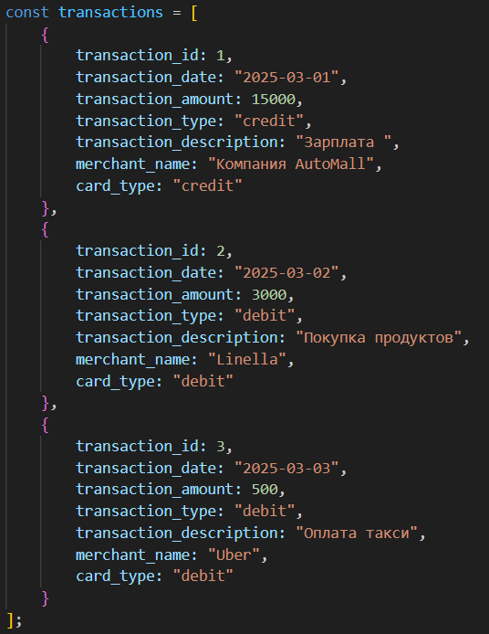

### Шаг 2. Реализация функций для анализа транзакций

Реализуйте следующие функции для анализа транзакций.

1. `getUniqueTransactionTypes(transactions)`
   - Возвращает массив уникальных типов транзакций.
   - Используйте `Set()` для выполнения задания.
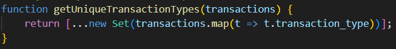

2. `calculateTotalAmount(transactions)` – Вычисляет сумму всех транзакций.
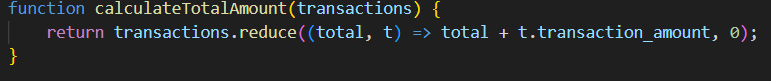

3. `getTransactionByType(transactions, type)` - Возвращает транзакции указанного типа (`debit` или `credit`).
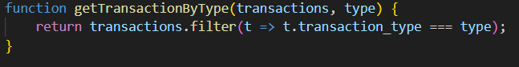

4. `getTransactionsInDateRange(transactions, startDate, endDate)` – Возвращает массив транзакций, проведенных в указанном диапазоне дат от `startDate` до `endDate`.
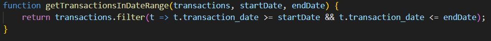

5. `getTransactionsByMerchant(transactions, merchantName)` – Возвращает массив транзакций, совершенных с указанным `merchantName`.
[merchantName](image-5.png)

6. `calculateAverageTransactionAmount(transactions)` – Возвращает среднее значение транзакций.
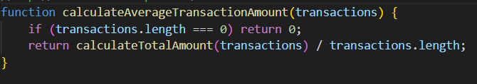

7. `getTransactionsByAmountRange(transactions, minAmount, maxAmount)` – Возвращает массив транзакций с суммой в заданном диапазоне от `minAmount` до `maxAmount`.
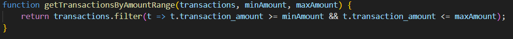

8. `calculateTotalDebitAmount(transactions)` – Вычисляет общую сумму дебетовых транзакций.
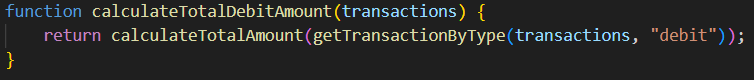

9. `findMostTransactionsMonth(transactions)` – Возвращает месяц, в котором было больше всего транзакций.
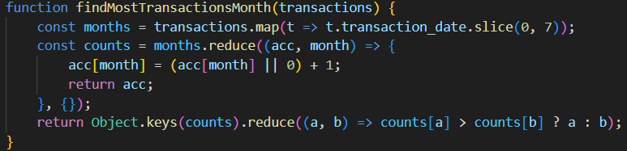

10. `findMostDebitTransactionMonth(transactions)` – Возвращает месяц, в котором было больше дебетовых транзакций.
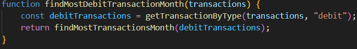

11. `mostTransactionTypes(transactions)`
    - Возвращает каких транзакций больше всего.
    - Возвращает `debit`, если дебетовых.
    - Возвращает `credit`, если кредитовых.
    - Возвращает `equal`, если количество равно.
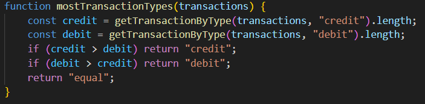

12. `getTransactionsBeforeDate(transactions, date)` – Возвращает массив транзакций, совершенных до указанной даты.
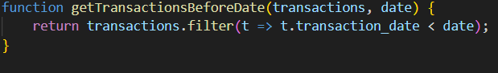

13. `findTransactionById(transactions, id)` – Возвращает транзакцию по ее уникальному идентификатору (`id`).

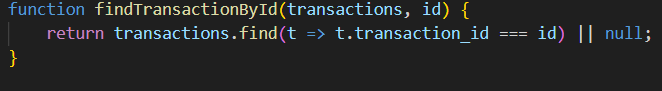
14. `mapTransactionDescriptions(transactions)` – Возвращает новый массив, содержащий только описания транзакций.
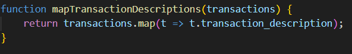
### Шаг 3. Тестирование функций

1. Создайте массив транзакций и протестируйте все функции.
2. Выведите результаты в консоль.
3. Проверьте работу функций на различных наборах данных.
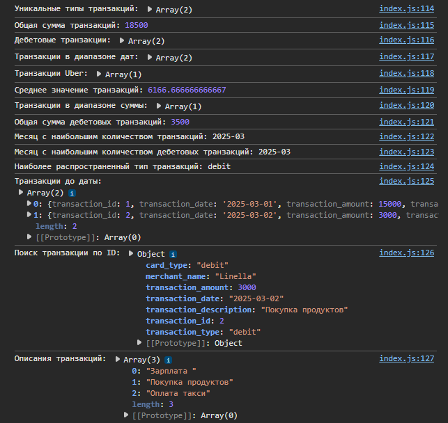
## Документирование кода

Код должен быть корректно задокументирован, используя стандарт `JSDoc`. Каждая функция и метод должны быть описаны с указанием их входных параметров, выходных данных и описанием функционала. Комментарии должны быть понятными, четкими и информативными, чтобы обеспечить понимание работы кода другим разработчикам.

## Контрольные вопросы

1. Какие методы массивов можно использовать для обработки объектов в JavaScript?
В JavaScript есть много методов для обработки массивов объектов. Вот самые полезные:

map() — используется, чтобы пройтись по каждому элементу массива и вернуть новый массив. Обычно применяют, чтобы достать определённые поля из объектов.

filter() — оставляет в массиве только те объекты, которые удовлетворяют какому-то условию.

reduce() — превращает массив в одно итоговое значение (например, сумму всех чисел или объединённый объект).

find() — находит и возвращает первый объект, который соответствует условию.

forEach() — просто перебирает массив, ничего не возвращает (используется для выполнения действий, например, вывода в консоль).

some() — проверяет, есть ли в массиве хотя бы один элемент, подходящий под условие.

every() — проверяет, соответствуют ли все элементы массива условию.

sort() — сортирует массив по определённому полю (например, по дате или сумме).

includes() — проверяет, есть ли в массиве определённое значение (обычно используется с простыми массивами, не с объектами)
2. Как сравнивать даты в строковом формате в JavaScript?
Если даты записаны в формате "ГГГГ-ММ-ДД" (например, "2025-03-01"), то их можно сравнивать как обычные строки:
"2025-03-01" < "2025-03-10" вернёт true

"2025-03-01" > "2025-02-28" вернёт true
3. В чем разница между `map()`, `filter()` и `reduce()` при работе с массивами объектов?
map() — применяет функцию к каждому элементу и создаёт новый массив с результатами. Например, получить только описания транзакций.

filter() — возвращает только те элементы, которые прошли проверку. Например, выбрать только "debit" транзакции.

reduce() — используется, чтобы свести весь массив к одному значению. Например, посчитать общую сумму всех транзакций.
